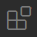

# Urban Computing Assignment 1

This repository contains the first assignment for the Urban Computing course in fall 2026. The exercises can be found in *"Assignment1_Exercises.ipynb"*. The completed assignment must be submitted through **Brightspace** as described in the *"Submission procedure"* section below.


## Docker and Visual Studio
We will be working in *development containers* that are completely isolated from your system's OS and software. One of the benefits of this approach is that you won't have to install any languages and dependencies on your machine and that everyone uses the exact same environment. This will benefit reproducibility and allows us to work cross-platform effortlessly.


## Installation
We will be using Visual Studio Code (VS Code) as IDE. The container development functionality of VS Code provides us better reproducibility and will help tremendously in running the code on different machines without effort.
First, clone this repository and open the repository folder in VS Code. Then choose one of the setup options below.

Three setup options are supported:

1. **Development container (recommended)** — uses Python 3.9.
2. **Python virtual environment (`venv`)** — fallback option using Python 3.12.
3. **LIACS servers over SSH** — if neither of the above works on your machine.

### Option 1: Development container (recommended)

**NOTE: installing Docker requires administrator rights.** If you do not have administrator rights or cannot use Docker, use the Python 3.12 `venv` option below.

Steps to create our working environment:
> - Make sure you have [Docker](https://docs.docker.com/get-docker/) installed on your system.
>     - If you are running Linux, make sure to follow the additional post-installation step [Manage Docker as a non-root user](https://docs.docker.com/engine/install/linux-postinstall/#manage-docker-as-a-non-root-user).
> - Make sure you have [VS Code](https://code.visualstudio.com/) installed on your system.
> - Clone and open this repository in VS Code.
> - Click on the extensions icon in the toolbar: .
> - Search for the *"Dev Containers"* extension and press the install button .
> - (Optional) Search for the *"Docker"* extension and install this extension. It allows you to manage containers from within VS Code.
> - You should now be able to see the *"Open a Remote Window"*  button in the bottom left corner.
> - Click this button and select *"Reopen in Container"*.
>     - Alternatively, open the Command Palette (`Ctrl+Shift+P` on Windows/Linux, `Cmd+Shift+P` on macOS) and select *"Dev Containers: Reopen in Container"*.
> - The container will now be build, which might take a while for the first time.
> - After the container is built, VS Code will be running within the container.
>     - You can check if VS Code is running within the container in the bottom left corner. It should say *"Dev Container: Python 3"*.
>     - You can also verify the Python version from the VS Code terminal with `python --version`. The development container uses Python 3.9.
> - If you need to rebuild the environment later, open the same bottom left menu and choose *"Rebuild Container"*.
> - Reload VS Code to activate linters and formatters: Ctrl/Cmd+Shift+P -> Developer: Reload Window. Alternatively, you can just close and reopen VS Code.
> 
> You can now open the notebook *"Assignment1_Exercises.ipynb"* and start working on your assignment.

### Option 2: Python 3.12 virtual environment

If you cannot use Docker, you can run the assignment locally using a standard Python 3.12 virtual environment. First, make sure [Python 3.12](https://www.python.org/downloads/) is installed on your system.

#### Windows
> Create the virtual environment:
> ```powershell
> py -3.12 -m venv .venv
> ```
> Activate it:
> ```powershell
> .venv\Scripts\Activate.ps1
> ```

#### macOS / Linux
> Create the virtual environment:
> ```bash
> python3.12 -m venv .venv
> ```
> Activate it:
> ```bash
> source .venv/bin/activate
> ```

#### Install the dependencies
> After activating the environment, run:
> ```bash
> python -m pip install --upgrade pip
> python -m pip install -r requirements.txt
> ```

Then open the repository in VS Code, open *"Assignment1_Exercises.ipynb"*, and select the Python interpreter from the `.venv` environment as the notebook kernel.

### Option 3: SSH Setup and Server Access Guide
In case you are unable to set it up in your local system with docker, you can also access [liacs servers](https://rel.liacs.nl/issc/ssh-access). Make sure to properly update your requirements file with the python version as per docker's.
#### 1. Download the SSH Config File
> Make sure your downloaded config file includes your **user ID** as mentioned in the comments.
#### 2. Move the Config File to Your SSH Folder
> Open Terminal and run:
> ```bash
> cp config ~/.ssh/config
> ```
#### 3. give permission to SSH 
> ```bash
> chmod 600 ~/.ssh/config
> chmod 700 ~/.ssh
> ```
#### 4. Connect to the server (example below)
Here you will be asked  twice for your password because it has to jump through main liacs server and then your suitable machine (do not panic, just give in your brightspace password)
> ```
> ssh U0065003
> ```

## Submission procedure

The assignment must be submitted through **Brightspace** before **September 29th, at 23:59**.

Submit **one ZIP file** named using your student number, for example:
```text
s1234567_Assignment1.zip
```

The ZIP file must contain:
- Your completed *"Assignment1_Exercises.ipynb"*.
- The *"requirements.txt"* file containing the Python packages and versions used for your solution.

**Important**: Run the notebook before submission and **keep all cells visible in the submitted notebook**. Do not clear outputs before uploading.

Do **not** include virtual environments, Git metadata, cache files, Docker images/containers, or unchanged files that were already provided with the assignment. In particular, do not submit folders such as *.venv/*, *.git/*, or *__pycache__/*.

### Updating `requirements.txt`

Before submission, make sure you are working inside the Python environment you used for the assignment (for example, the development container or your virtual environment). Do **not** run the following command from your system/global Python environment.

Then run:
```bash
python -m pip freeze > requirements.txt
```

This records the installed Python packages and their versions so that we can reproduce your environment when grading.

### Final check

Before creating the ZIP file:
1. Make sure the notebook runs from beginning to end without errors in the environment you used for the assignment.
2. Save the notebook after running it so that the outputs are included.
3. Check that the ZIP contains *"Assignment1_Exercises.ipynb"* and *"requirements.txt"* before uploading it to Brightspace.
## Tips & Tricks
> - You can install additional Python packages while within the Python container through: `pip install <your package>`.
> - A light VS Code theme might be preferred while working with Python notebooks
>     - To change themes: File/Code -> Preferences -> Color Theme
> - (advanced) If you need to install non-Python packages, uncomment the last line in the *".devcontainer/Dockerfile"* file and add the packages in the placeholder. Rebuild your container to install the packages.

# References
## Development Containers
> - [Beginner's Series to Dev Containers](https://www.youtube.com/watch?v=61M2takIKl8&list=PLj6YeMhvp2S5G_X6ZyMc8gfXPMFPg3O31) on Youtube

## Numpy & Pandas
> - [Cloud X Lab - introduction to Numpy and Pandas](https://cloudxlab.com/blog/numpy-pandas-introduction/)
> - [Zero With Dot - Performance of numpy and pandas - comparison](https://zerowithdot.com/python-numpy-and-pandas-performance/)
> - [Sofia Heisler - A Beginner’s Guide to Optimizing Pandas Code for Speed](https://engineering.upside.com/a-beginners-guide-to-optimizing-pandas-code-for-speed-c09ef2c6a4d6) basic optimization techniques, see also her PyCon 2017 talk on [YouTube](https://www.youtube.com/watch?v=HN5d490_KKk).
> - [Pandas - Enhancing Performance](https://pandas.pydata.org/pandas-docs/stable/user_guide/enhancingperf.html) deeper enhancement techniques
> - [Numexpr](https://github.com/pydata/numexpr) easily speed up more complex numpy operations
> - [Real Python - Look Ma, No For-Loops: Array Programming With NumPy](https://realpython.com/numpy-array-programming/) a somewhat easier introduction to vectorization
> - [Python Like You Mean It - Vectorized Operations](https://www.pythonlikeyoumeanit.com/Module3_IntroducingNumpy/VectorizedOperations.html) a bit more advanced text about vectorization

## Matplotlib
> - [Real Python - Python Plotting With Matplotlib (Guide)](https://realpython.com/python-matplotlib-guide/)
> - [Practical Business Python - Effectively Using Matplotlib](https://pbpython.com/effective-matplotlib.html)
